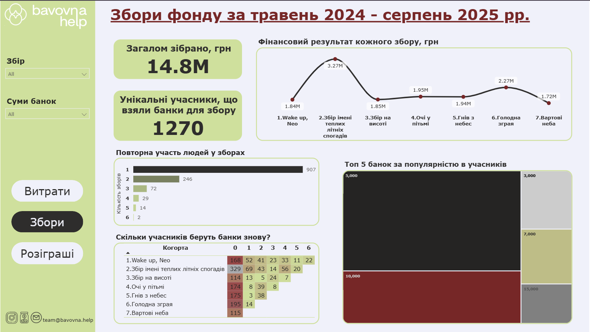

# 📊 Дашборд Bavovna Help
Цей дашборд відображає фінансову аналітику благодійного фонду Bavovna Help за період травень 2024 — серпень 2025. 
📌 Ключові напрямки діяльності фонду:
  - Витрати: обладнання для зв’язку, ремонт дронів і авто, акумулятори та інші критично важливі речі. 
  - Збори: ініціативи, які об’єднують сотні людей і допомагають акумулювати мільйони гривень. За цей час понад 1200 учасників взяли банки для збору на суму майже 15 млн грн. Особливо цікаво було подивитись на повторні участі у зборах - видно, що люди повертаються, і так формується справжня спільнота. 
  - Розіграші:  зібрали майже 1 млн грн, і тут також видно людей, які повертаються знову.

⚠️ Важливо: використані дані носять ілюстративний характер, через відсутність можливості працювати з динамічною картиною щоденних ситуативних донатів та різницю задекларованих та фактичних сум допоміжних банок. 

🔗 [Перейти до інтерактивного дашборду](https://app.powerbi.com/reportEmbed?reportId=663c7e10-efa5-4478-8731-a0cc8daf92fa&autoAuth=true&ctid=226284fe-d303-43af-b4d9-64b5e861dfea)

📷 

