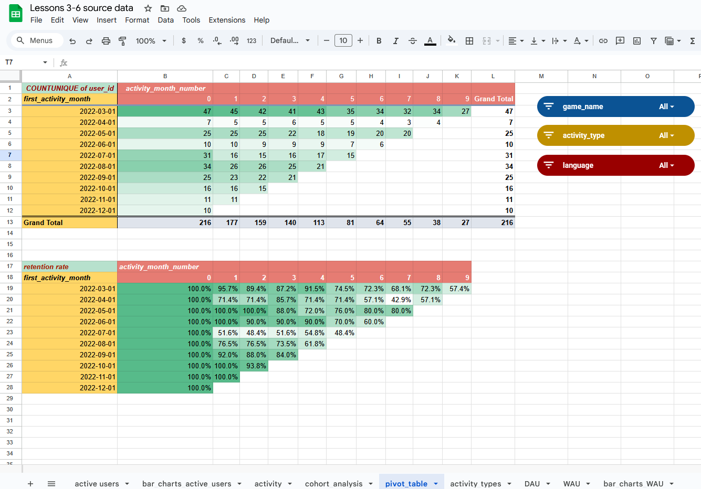

# 📗 Проєкти Google Sheets

## 📌 Проєкт: Аналіз доходів та поведінки користувачів ігор

Цей проєкт присвячений аналізу користувацької поведінки та монетизації мобільних ігор.
- Додано ключові метрики по кожній грі:
  - `Total Revenue` — загальний дохід
  - `Paid Users Count` — кількість платних користувачів
  - `CR to Paid` — конверсія в платних користувачів (%)
  - `ARPPU` — середній дохід на платного користувача
  - `Середній`, `Медіанний`, `Мінімальний`, `Максимальний` вік платних користувачів

- Додано підсумковий рядок **“Total”** для обчислення загальних значень по всіх іграх

🔗 [Переглянути таблицю](https://docs.google.com/spreadsheets/d/1HZo04_lgxyDE71YbKxHFV27XerpPfz8Y-cMFcAxXm-U/edit?gid=567183743#gid=567183743)  

📸 Знімок екрана:  

---

## 📌 Проєкт: Аналіз користувацької активності, DAU/WAU та когорт

## 📄 Опис

Цей проєкт охоплює повний цикл аналізу користувачів мобільного застосунку: від описової статистики до когортного аналізу, побудови прогнозів та візуалізацій. 
Усі розрахунки реалізовано за допомогою вбудованих функцій, формул, pivot table та графіків:
  - статистика віку активних користувачів
  - DAU, WAU, Stickiness
  - обробка подій активності
  - візуалізації
  - когортний аналіз

🔗 [Переглянути таблицю](https://docs.google.com/spreadsheets/d/1rlpBc75vyDFR1VWb5E9CMjhgliPnpiBISONhGK-H_TI/edit?gid=0#gid=0)  

📸 Знімок екрана:  

---
