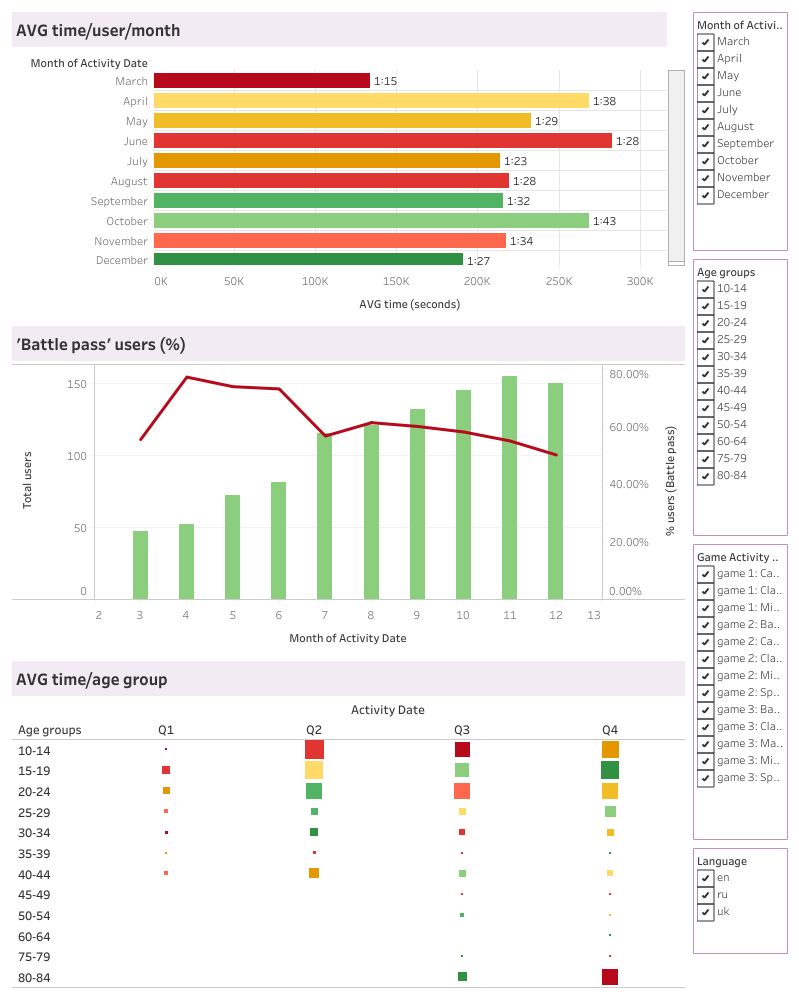
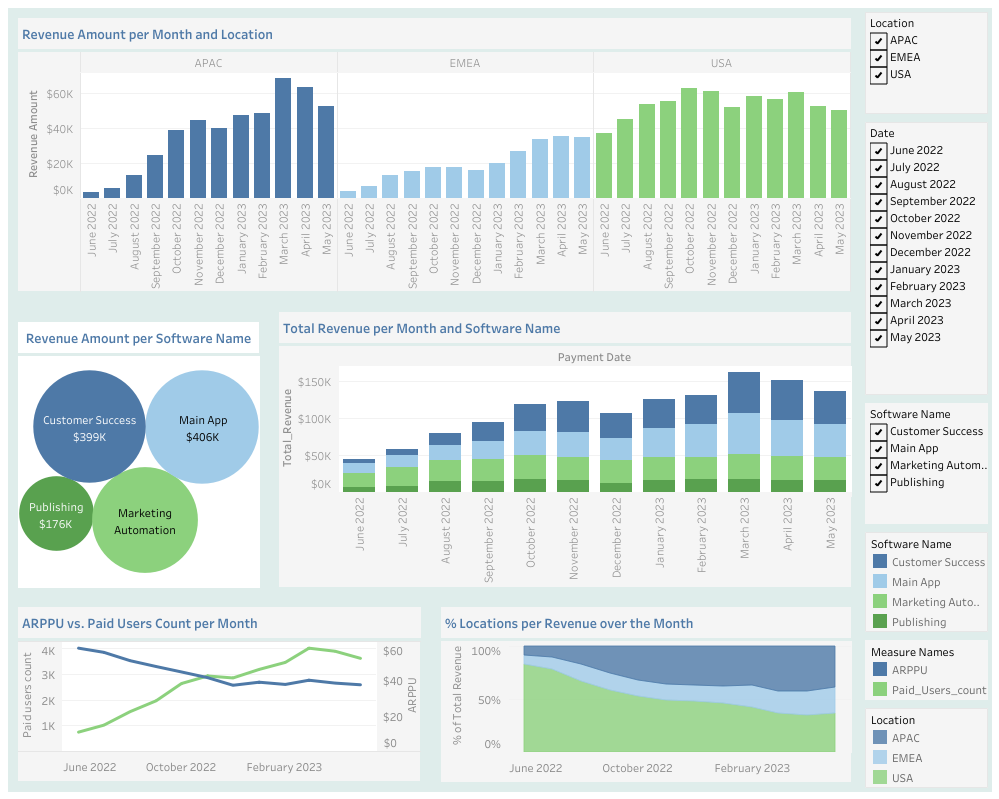

# 📊 Tableau Projects

## 📁 Projects

### 1. 🧩 Аналіз активності користувачів мобільної гри 

🔗 [View Dashboard](https://public.tableau.com/views/_17513603848930/Dashboard1?:language=en-US&:sid=&:redirect=auth&:display_count=n&:origin=viz_share_link)    📷 
---

### 2. 🧩 Аналіз Revenue продуктової компанії 

🔗 [View Dashboard](https://public.tableau.com/views/Revenue_17513590800630/Dashboard1?:language=en-US&:sid=&:redirect=auth&:display_count=n&:origin=viz_share_link) 
📷 
---

### 3. 🧩 Аналіз Revenue продуктової компанії, когортний аналіз 

🔗 [View Dashboard](https://public.tableau.com/views/Revenue_17513592774390/Dashboard2?:language=en-US&:sid=&:redirect=auth&:display_count=n&:origin=viz_share_link) 
📷 
---

### 4. 🧩 Аналіз проходження користувачами кроків від реєстрації до першої оплати

🔗 [View Dashboard](https://public.tableau.com/views/Homework_5_Kryvosheia-Zakharova/Dashboard1?:language=en-US&:sid=&:redirect=auth&:display_count=n&:origin=viz_share_link)  
📷 

---

### 5. 🧩 Метрики Revenue продуктової компанії в розрізі 2022-2023 років 

🔗 [View Dashboard](https://public.tableau.com/views/Homework_2_Kryvosheia-Zakharova/Dashboard1?:language=en-US&:sid=&:redirect=auth&:display_count=n&:origin=viz_share_link)
📷 
---

